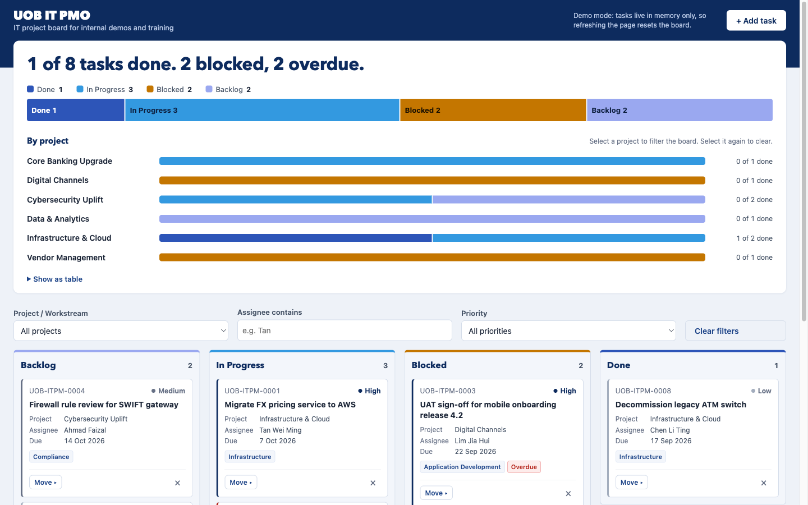
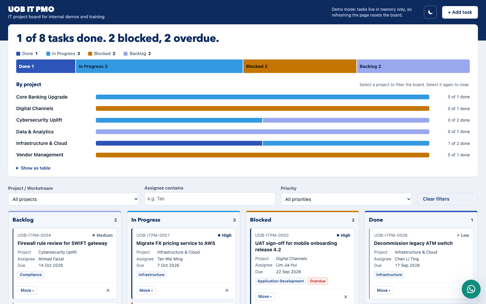

# UOB IT PMO — Kanban Board

A single-file IT Project Management Kanban board for internal demos and training. Track IT project tasks across **Backlog → In Progress → Blocked → Done**, filter the board, and add, move or delete tasks. Everything runs in the browser with no build step, and there are no dependencies.

**Live demo:** https://hooisiam.github.io/kanban4/

**New design (v2):** https://hooisiam.github.io/kanban4/v2/ adds a delivery progress chart, a light/dark mode toggle, a welcome message and an IT Support chat widget. See [v2](#v2-redesign) below.

## Screenshot



## Features

- Four columns (Backlog, In Progress, Blocked, Done) with a count badge on each
- Header summary of task totals by status, plus the number of overdue tasks
- Tasks have an ID (`UOB-ITPM-####`), title, description, project/workstream, category, assignee, priority and due date
- Colour-coded priority (Critical / High / Medium / Low) and **Overdue** badges
- Move cards by drag and drop, or with the keyboard-accessible **Move ▸** menu
- Inline "Delete? Yes / No" confirmation on the card, with no pop-up dialogs
- Filter by project, priority and assignee
- Add Task form with inline validation, plus an optional email notification through [FormSubmit](https://formsubmit.co)
- Comes with 8 sample tasks whose due dates are relative to today

## v2 redesign

[`v2/index.html`](v2/index.html) is a separate redesign of the same board, published at https://hooisiam.github.io/kanban4/v2/. The original design above is unchanged.



What v2 adds:

- **Delivery progress panel:** a plain-language headline (for example "1 of 8 tasks done. 2 blocked, 2 overdue."), an overall stacked bar by status, and one stacked bar per project. Hover a segment for exact numbers, select a project to filter the board, or open **Show as table**
- Status colours shared by the chart and the columns, checked for colour-blind safety
- Quieter cards, where only Critical priority is shown in red
- **Light / dark mode:** a sun/moon button in the header switches the theme. The page first follows the device's light or dark setting. The choice is kept in memory only, so a refresh returns to the device setting. Dark mode colours pass WCAG AA contrast
- **Welcome message:** after 10 seconds on the page, a dialog thanks the visitor and gives the IT Support hotline. It shows once per visit, and if the Add Task form is open it waits until the form closes
- **IT Support chat widget:** a WhatsApp-style chat button in the bottom-right corner opens the "IT Support Buddy" panel, with a cartoon puppy (inline SVG). Pick one of six suggested questions (password reset, VPN, software requests, slow laptop, phishing, printer) to get an instant answer. The panel also links to the hotline. The answers are written into the page and work offline, and the widget doesn't connect to WhatsApp
- A Content-Security-Policy that allows only the page's own script (pinned by hash) and network calls to FormSubmit, and a no-referrer policy

## Run locally

Clone the repo and open `index.html` in any modern browser. You don't need a server or a build step.

```bash
git clone https://github.com/hooisiam/kanban4.git
open kanban4/index.html
```

## Tech and constraints

- Vanilla HTML, CSS and JavaScript in a single `index.html`, with no frameworks, libraries or CDN assets
- **No persistence:** board state is kept in memory only, so refreshing the page resets it to the sample data
- No `localStorage`, cookies, `alert()` or `confirm()`
- All user input is HTML-escaped before it's rendered

## Configuration

To get an email whenever a task is added, set the FormSubmit endpoint at the top of the `<script>` block in `index.html`:

```js
const FORMSUBMIT_ENDPOINT = "https://formsubmit.co/ajax/YOUR_EMAIL@example.com";
```

If the request fails, the task is still added and a warning toast appears.

In `v2/index.html`, these settings sit next to the endpoint:

| Constant | What it sets |
|---|---|
| `WELCOME_DELAY_MS` | How long a visitor stays before the welcome dialog opens (default `10000`, 10 seconds) |
| `SUPPORT_HOTLINE` | The IT Support number shown in the welcome dialog and the chat widget |
| `SUPPORT_QUERIES` | The chat widget's suggested questions and their answers |

v2's Content-Security-Policy pins the inline script by its SHA-256 hash. After any change to v2's `<script>` block, recompute the hash. [CLAUDE.md](CLAUDE.md) has the command. Otherwise the page stops running.

## Deployment

A GitHub Actions workflow (`.github/workflows/pages.yml`) publishes `index.html` and `v2/index.html` to GitHub Pages on every push to `main`. You can also run it by hand from the **Actions** tab. In the repository settings, set **Settings → Pages → Source** to **GitHub Actions**.

## Disclaimer

This is an internal demo/training tool. It's **not** an official UOB system and doesn't use any UOB logos or trademarks.
